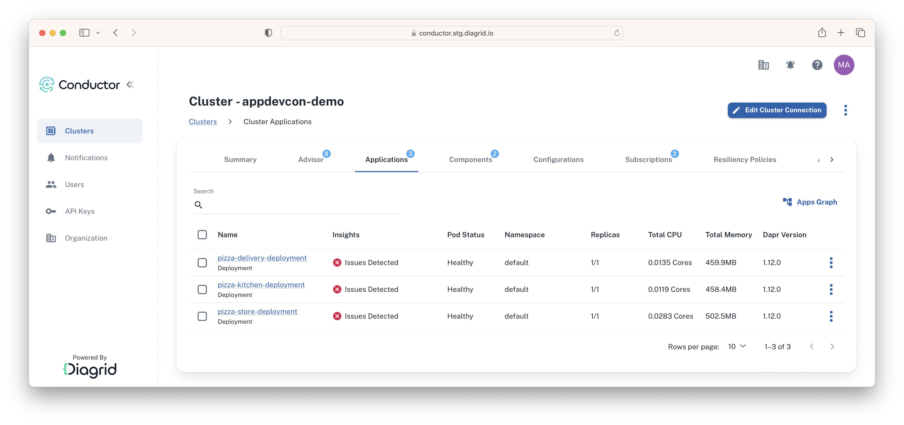

# Cloud-Native Pizza Delivery system

This repository contains a simple example for a Pizza Store application using Kubernetes, [Dapr](https://dapr.io) and [Testcontainers](https://testcontainers.com) to enable developers with an awesome developer experience.


You can run this application on any Kubernetes cluster by following the step-by-step insturctions described in this document. 

## Installation

If you don't have a Kubernetes Cluster you can [install KinD](https://kind.sigs.k8s.io/docs/user/quick-start/) to create a local cluster to run the application. 

Once you have KinD installed you can run the following command to create a local Cluster: 

```
kind create cluster
```

Then we will install [Dapr](https://dapr.io) into our fresh new cluster by running the following command: 

```
helm repo add dapr https://dapr.github.io/helm-charts/
helm repo update
helm upgrade --install dapr dapr/dapr \
--version=1.12.0 \
--namespace dapr-system \
--create-namespace \
--wait
```

## Installing infrastructure for the application

We will be using Kafka for sending messages between services: 

```
helm install kafka oci://registry-1.docker.io/bitnamicharts/kafka --version 22.1.5 --set "provisioning.topics[0].name=events-topic" --set "provisioning.topics[0].partitions=1" --set "persistence.size=1Gi" 
```

We will be using PostgreSQL as our persistent store, but before installing the PostgreSQL Chart run:

```
kubectl apply -f k8s/pizza-init-sql-cm.yaml
```

Then: 

```
helm install postgresql oci://registry-1.docker.io/bitnamicharts/postgresql --version 12.5.7 --set "image.debug=true" --set "primary.initdb.user=postgres" --set "primary.initdb.password=postgres" --set "primary.initdb.scriptsConfigMap=pizza-init-sql" --set "global.postgresql.auth.postgresPassword=postgres" --set "primary.persistence.size=1Gi"

```

## Installing the Application

To install the application you only need to run the following command: 

```
kubectl apply -f k8s/
```

This install all the application services. To avoid dealing with Ingresses you can access the application by using `kubectl port-forward`, run to access the application on port `8080`: 

```
kubectl port-forward svc/pizza-store 8080:80
```

Then you can point your browser to [`http://localhost:8080`](http://localhost:8080) and you should see: 


## Building from source / changing the services

The application services are written using Java + Spring Boot. These services use the Dapr Java SDK to interact with the Dapr [PubSub](https://docs.dapr.io/getting-started/quickstarts/pubsub-quickstart/) and [Statestore](https://docs.dapr.io/getting-started/quickstarts/statemanagement-quickstart/) APIs. 

To run the services locally you can use the [Testcontainer](https://testcontainaers.com) integration already included in the projects. 

For example you can start a local version of the `pizza-store` service by running the following command inside the `pizza-store/` directory (this requires having Java and [Maven](https://maven.apache.org/) installed locally):

```
mvn spring-boot:test-run
```

This, not only start the `pizza-store` service, but it also uses the [Testcontainers + Dapr Spring Boot](https://central.sonatype.com/artifact/io.diagrid.dapr/dapr-spring-boot-starter) integration to configure and wire up a Dapr configuration for local development. In other words, you can now use Dapr outside of Kubernetes, for writing your service tests without the need to know how Dapr is configured. 


Once the service is up, you can place orders and simulate other events coming from the Kitchen and Delivery services by sending HTTP requests to the `/events` endpoint. 

Using [`httpie`](https://httpie.io/) this look like this: 

```
http :8080/events Content-Type:application/cloudevents+json < pizza-store/event-in-prep.json
```

In the Application you should see the event recieved that the order moving forward. 

## Diagrid's Conductor to manage Dapr Applications

When you are running Dapr applications at scale, you might want to leverage the observability features provided by Dapr. One way to do so is to use [Diagrid's Conductor SaaS offering](https://www.diagrid.io/conductor). 

Before starting you need to make sure that your cluster has the metrics server installed: 

```
kubectl apply -f https://github.com/kubernetes-sigs/metrics-server/releases/download/v0.5.0/components.yaml

```
and configured correctly: 

```
kubectl patch -n kube-system deployment metrics-server --type=json \
  -p '[{"op":"add","path":"/spec/template/spec/containers/0/args/-","value":"--kubelet-insecure-tls"}]'
```

Then, with your Diagrid's Conductor account you can install the Conductor agent in your cluster. The Conductor's agent will recognize your Dapr installation and monitor your applications automatically. If you access Conductors interface you can make sure that your Dapr applications are running securely and efficiently in your clusters. 



# Resources and references

- [Platform engineering on Kubernetes Book](http://mng.bz/jjKP?ref=salaboy.com)
- [Testcontainers for Go Developers](https://www.atomicjar.com/2023/08/local-development-of-go-applications-with-testcontainers/)
- [Cloud native local development with Dapr and Testcontainers](https://www.diagrid.io/blog/cloud-native-local-development)

# Feedback / Comments / Contribute

Feel free to create issues or get in touch with us using Issues or via [Twitter @Salaboy](https://twitter.com/salaboy)